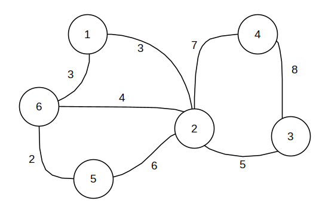

# min-edge-cut-solver
Brute force solver for the problem of Minimum edge cut of an edge-valued graph in C++ using BB-DFS algorithm with 4 approaches - sequential, task parallel, data parallel and task parallel on MPI for computational cluster. 

## input file format
```
n - number of nodes
graph data matrix with weighed edges
```
Example:
```
6
     0     3     0     0     0     3
     3     0     5     7     6     4
     0     5     0     8     0     0
     0     7     8     0     0     0
     0     6     0     0     0     2
     3     4     0     0     2     0
```
The graph:

